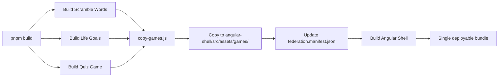

# README - Monolithic Master Micro-Frontend Shell

## 🎯 What Changed?

Your project is now a **monolithic pnpm workspace** - everything builds and serves from a single command!

**Before:**

- Start 4 separate servers (Angular Shell + 3 games)
- Deploy 4 separate bundles
- Complex CORS configuration

**Now:**

- ✅ Single `pnpm dev` command starts everything
- ✅ Single `pnpm build` creates one deployable bundle
- ✅ All games served from Angular Shell assets
- ✅ No CORS issues (same origin)

---

## 🚀 Quick Start

### Development

```bash
# Install dependencies for all workspace projects
pnpm install

# Start everything (Shell + all games)
pnpm dev
```

Access at: **http://localhost:4200**

Or use the convenience script:

```bash
start-dev.bat    # Windows
```

### Production Build

```bash
# Build everything into single bundle
pnpm build
```

Output: `angular-shell/dist/angular-shell/browser/`

---

## 📁 Project Structure

```
app-store/                           # pnpm workspace root
├── package.json                     # Workspace scripts
├── pnpm-workspace.yaml             # Workspace configuration
├── scripts/
│   └── copy-games.js               # Copies games to Shell assets
│
├── angular-shell/                  # Angular Shell (Host)
│   ├── src/assets/games/           # Built games copied here
│   │   ├── scramble-words/
│   │   ├── life-goals/
│   │   └── quiz-game/
│   └── src/assets/federation.manifest.json
│
├── Scramble-Words/                 # React Game 1
├── game12/                         # React Game 2 (life-goals)
└── quiz-game/                      # React Game 3
```

---

## 🛠 Available Commands

### Root Level (Workspace)

| Command            | Description                       |
| ------------------ | --------------------------------- |
| `pnpm install`     | Install all dependencies          |
| `pnpm dev`         | Start development (Shell + games) |
| `pnpm build`       | Build everything                  |
| `pnpm build:games` | Build only games + copy to Shell  |
| `pnpm build:shell` | Build only Angular Shell          |
| `pnpm serve`       | Serve built Shell                 |
| `pnpm clean`       | Clean all builds and dependencies |

### Individual Projects

```bash
# Work on specific project
pnpm --filter angular-shell dev:serve
pnpm --filter scramble-words build
pnpm --filter life-goals test
```

---

## 🏗 How Monolithic Build Works

### Build Process



1. **pnpm build:games**
   - Builds all 3 React games
   - Runs `copy-games.js` script
   - Copies builds to `angular-shell/src/assets/games/`
   - Updates manifest to use `/assets/games/*` paths

2. **pnpm build:shell**
   - Builds Angular Shell
   - Includes all game bundles in assets
   - Creates single `dist/` folder

3. **Result**
   - One folder to deploy
   - All games accessible from `/assets/games/`
   - No separate game servers needed

### Federation Manifest

**Development manifest** (auto-updated by `copy-games.js`):

```json
{
  "scramble-words": {
    "remoteEntry": "/assets/games/scramble-words/index.js"
  }
}
```

All paths are relative to the Angular Shell - no external URLs!

---

## 🚢 Deployment

### Option 1: Docker

```bash
docker build -t microfrontend-shell .
docker run -p 80:80 microfrontend-shell
```

### Option 2: Static Hosting

```bash
pnpm build
cd angular-shell/dist/angular-shell/browser
# Upload this folder to your hosting
```

### Option 3: Nginx

```bash
pnpm build
cp -r angular-shell/dist/angular-shell/browser/* /var/www/html/
# Use the included nginx.conf
```

---

## 📊 Workspace Configuration

### pnpm-workspace.yaml

```yaml
packages:
  - "angular-shell"
  - "Scramble-Words"
  - "game12"
  - "quiz-game"
```

### Package Names

- `angular-shell` - Angular Shell
- `scramble-words` - Game 1
- `life-goals` - Game 2
- `quiz-game` - Game 3

---

## 🔧 Development Workflow

### Typical Development Session

```bash
# 1. Install dependencies (first time only)
pnpm install

# 2. Start development
pnpm dev

# 3. Make changes to any project
# - Changes hot-reload automatically
# - Games load from localhost dev servers
# - Shell serves on port 4200

# 4. Build for production
pnpm build

# 5. Test production build locally
pnpm serve:prod
```

### Working on a Single Game

```bash
# Just work on Life Goals
cd game12
pnpm dev

# In another terminal, run Shell
cd angular-shell
pnpm dev:serve
```

---

## 🎮 Testing

### Local Testing

```bash
# Start everything
pnpm dev

# Visit
# - http://localhost:4200 (Lobby)
# - http://localhost:4200/play/life-goals
# - http://localhost:4200/play/scramble-words
# - http://localhost:4200/play/quiz-game
```

### Production Build Testing

```bash
# Build
pnpm build

# Serve production build
cd angular-shell
pnpm serve:prod

# Visit http://localhost:4200
```

---

## 📦 What Gets Built

### Production Output

```
angular-shell/dist/angular-shell/browser/
├── index.html
├── main.*.js
├── polyfills.*.js
├── assets/
│   ├── federation.manifest.json
│   └── games/
│       ├── scramble-words/
│       │   ├── index.html
│       │   ├── index.js
│       │   └── assets/
│       ├── life-goals/
│       │   ├── index.html
│       │   ├── index.js
│       │   └── assets/
│       │       └── videos/ (9 MP4s)
│       └── quiz-game/
│           ├── index.html
│           ├── index.js
│           └── assets/
```

**Total size**: ~50-100MB (includes all videos)

---

## ✨ Benefits

### Development

- ✅ Single command to start everything
- ✅ Automatic hot-reload for all projects
- ✅ No CORS configuration needed
- ✅ Shared dependencies via workspace

### Production

- ✅ One folder to deploy
- ✅ All assets from same origin
- ✅ Simplified CDN configuration
- ✅ Better caching strategy

### Maintenance

- ✅ Unified dependency management
- ✅ Single version control
- ✅ Consistent build process
- ✅ Easy to add new games

---

## 🆕 Adding New Games

1. Create game in workspace root:

```bash
cd app-store
pnpm create vite new-game --template react
```

2. Add to `pnpm-workspace.yaml`:

```yaml
packages:
  - "new-game"
```

3. Build will automatically include it!

---

## 🔍 Troubleshooting

### "Module not found" errors

```bash
pnpm install
```

### Games not showing in Shell

```bash
pnpm build:games
```

### Build fails

```bash
pnpm clean
pnpm install
pnpm build
```

### Port already in use

- Kill process on port 4200
- Or change port in `angular-shell/package.json`

---

## 📚 Documentation

- [QUICKSTART.md](QUICKSTART.md) - Quick reference
- [DEPLOYMENT.md](DEPLOYMENT.md) - Detailed deployment guide
- [Walkthrough](brain/.../walkthrough.md) - Architecture details

---

## 🎉 You're Ready!

```bash
pnpm install
pnpm dev
```

Visit **http://localhost:4200** and enjoy your monolithic micro-frontend shell!
